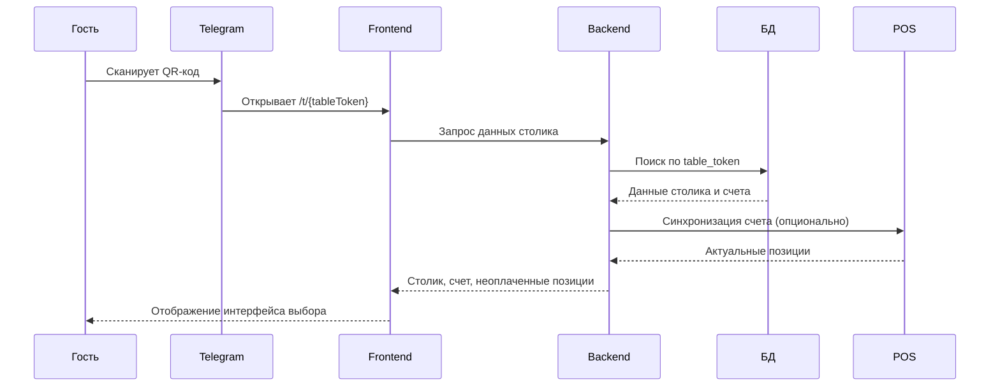
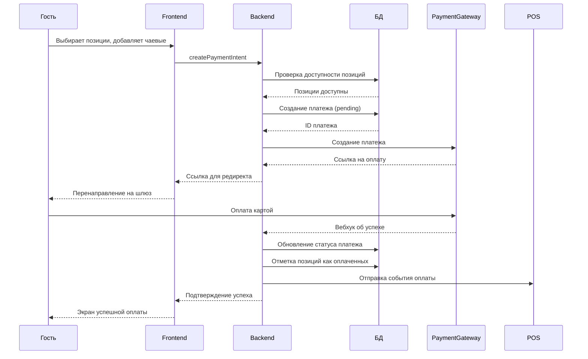
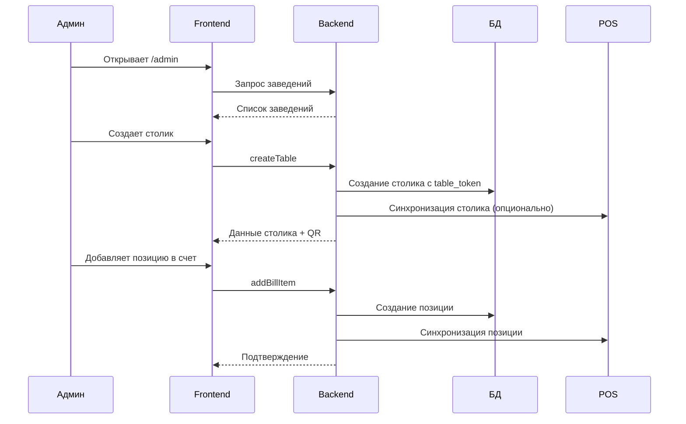

# Архитектура Telegram Mini App для разделения счетов

## Введение

Система предназначена для баров, кафе и ресторанов, где посетители могут самостоятельно оплачивать свои позиции через Telegram Mini App. Гость сканирует QR-код на столе, видит неоплаченные позиции, выбирает те, за которые хочет заплатить, добавляет чаевые и завершает оплату. Система интегрируется с учетными системами заведения (iiko, R-Keeper и др.) для синхронизации столиков, счетов и позиций.

**Цели:**
- Упростить процесс разделения счетов для гостей
- Снизить нагрузку на персонал заведения
- Обеспечить интеграцию с существующими POS-системами
- Поддержать мультитенантность (несколько заведений)
- Обеспечить безопасность и конфиденциальность платежей

## Обзор архитектуры

Система построена как монолитное Next.js приложение с использованием App Router, где фронтенд и бэкенд находятся в одном проекте. Это упрощает развертывание и обеспечивает согласованность типов.

```mermaid
graph TB
    subgraph "Внешние системы"
        Telegram[Telegram Mini App]
        POS[POS-система iiko/R-Keeper]
        Payment[Платежный шлюз]
    end

    subgraph "Фронтенд (Next.js)"
        GuestUI[Гостевая страница /t/[tableToken]]
        AdminUI[Админ-панель /admin]
        BotUI[Интерфейс бота]
    end

    subgraph "Бэкенд (Next.js Server)"
        API[API Route Handlers]
        Actions[Server Actions]
        Services[Доменные сервисы]
        Adapter[POS-адаптер]
    end

    subgraph "Хранилище"
        DB[(SQLite/PostgreSQL)]
        Cache[(Кэш Redis)]
    end

    Telegram --> GuestUI
    GuestUI --> Actions
    AdminUI --> Actions
    BotUI --> API
    Actions --> Services
    Services --> Adapter
    Adapter --> POS
    Services --> DB
    API --> DB
    Services --> Cache
    Payment --> API
```

## Компоненты системы

### 1. Telegram Mini App (фронтенд)
- **Гостевая страница** (`/t/[tableToken]`) – интерфейс выбора позиций, добавления чаевых, оплаты
- **Админ-панель** (`/admin`) – управление столиками, счетами, позициями, просмотр статистики
- **Интерфейс бота** – настройка заведения, генерация QR-кодов, мониторинг

### 2. Бэкенд API
- **Next.js Route Handlers** – RESTful API для внешних интеграций
- **Server Actions** – мутации для фронтенда (создание счетов, добавление позиций, оплата)
- **Доменные сервисы** – бизнес-логика (управление столиками, счетами, платежами)
- **POS-адаптер** – абстракция для интеграции с учетными системами

### 3. База данных
- **SQLite** (разработка) / **PostgreSQL** (продакшен)
- **Drizzle ORM** – типизированный доступ к данным
- **Миграции** – управление схемой

### 4. Интеграции
- **POS-системы** (iiko, R-Keeper, Poster и др.) через адаптеры
- **Платежные шлюзы** (ЮKassa, Stripe, CloudPayments и др.)
- **Telegram Bot API** – управление ботом, отправка уведомлений

### 5. Telegram Bot
- **Команды** – настройка заведения, генерация QR-кодов, статистика
- **Webhook** – обработка событий от Telegram
- **Админ-интерфейс** – упрощенное управление через чат

## Схема базы данных

```sql
-- Заведение
CREATE TABLE venues (
    id TEXT PRIMARY KEY,
    name TEXT NOT NULL,
    currency TEXT NOT NULL DEFAULT 'RUB',
    tip_presets JSONB NOT NULL DEFAULT '[0, 5, 10, 15]',
    pos_config JSONB, -- конфигурация интеграции с POS
    created_at TIMESTAMP NOT NULL DEFAULT CURRENT_TIMESTAMP,
    updated_at TIMESTAMP NOT NULL DEFAULT CURRENT_TIMESTAMP
);

-- Столик
CREATE TABLE tables (
    id TEXT PRIMARY KEY,
    venue_id TEXT NOT NULL REFERENCES venues(id) ON DELETE CASCADE,
    label TEXT NOT NULL, -- номер или название столика
    table_token TEXT NOT NULL UNIQUE, -- секретный токен для QR-кода
    external_id TEXT, -- идентификатор в POS-системе
    is_active BOOLEAN NOT NULL DEFAULT TRUE,
    created_at TIMESTAMP NOT NULL DEFAULT CURRENT_TIMESTAMP,
    updated_at TIMESTAMP NOT NULL DEFAULT CURRENT_TIMESTAMP
);

-- Счет
CREATE TABLE bills (
    id TEXT PRIMARY KEY,
    venue_id TEXT NOT NULL REFERENCES venues(id) ON DELETE CASCADE,
    table_id TEXT NOT NULL REFERENCES tables(id) ON DELETE CASCADE,
    status TEXT NOT NULL DEFAULT 'open', -- open, closed
    external_id TEXT, -- идентификатор в POS-системе
    opened_at TIMESTAMP NOT NULL DEFAULT CURRENT_TIMESTAMP,
    closed_at TIMESTAMP,
    created_at TIMESTAMP NOT NULL DEFAULT CURRENT_TIMESTAMP,
    updated_at TIMESTAMP NOT NULL DEFAULT CURRENT_TIMESTAMP
);

-- Позиция счета
CREATE TABLE bill_items (
    id TEXT PRIMARY KEY,
    bill_id TEXT NOT NULL REFERENCES bills(id) ON DELETE CASCADE,
    name TEXT NOT NULL,
    unit_price INTEGER NOT NULL, -- в копейках/центах
    quantity INTEGER NOT NULL DEFAULT 1,
    status TEXT NOT NULL DEFAULT 'unpaid', -- unpaid, paid
    external_id TEXT, -- идентификатор в POS-системе
    paid_at TIMESTAMP,
    paid_by_guest_name TEXT,
    paid_by_telegram_id BIGINT,
    payment_id TEXT REFERENCES payments(id),
    created_at TIMESTAMP NOT NULL DEFAULT CURRENT_TIMESTAMP,
    updated_at TIMESTAMP NOT NULL DEFAULT CURRENT_TIMESTAMP
);

-- Платеж
CREATE TABLE payments (
    id TEXT PRIMARY KEY,
    bill_id TEXT NOT NULL REFERENCES bills(id) ON DELETE CASCADE,
    status TEXT NOT NULL DEFAULT 'pending', -- pending, succeeded, failed, refunded
    item_subtotal INTEGER NOT NULL, -- сумма выбранных позиций (копейки)
    tip_amount INTEGER NOT NULL DEFAULT 0, -- чаевые (копейки)
    total_amount INTEGER NOT NULL, -- итого (копейки)
    telegram_user_id BIGINT,
    guest_name TEXT,
    payment_method TEXT, -- card, apple_pay, google_pay, etc.
    payment_provider TEXT, -- yookassa, stripe, etc.
    provider_payment_id TEXT, -- идентификатор платежа в шлюзе
    metadata JSONB,
    created_at TIMESTAMP NOT NULL DEFAULT CURRENT_TIMESTAMP,
    updated_at TIMESTAMP NOT NULL DEFAULT CURRENT_TIMESTAMP
);

-- Связь платежа и позиций (многие-ко-многим)
CREATE TABLE payment_items (
    payment_id TEXT NOT NULL REFERENCES payments(id) ON DELETE CASCADE,
    bill_item_id TEXT NOT NULL REFERENCES bill_items(id) ON DELETE CASCADE,
    amount_at_payment INTEGER NOT NULL, -- цена на момент оплаты (копейки)
    PRIMARY KEY (payment_id, bill_item_id)
);

-- События интеграции (лог для отладки и синхронизации)
CREATE TABLE integration_events (
    id TEXT PRIMARY KEY,
    venue_id TEXT NOT NULL REFERENCES venues(id) ON DELETE CASCADE,
    type TEXT NOT NULL, -- bill_created, item_added, payment_succeeded, etc.
    payload JSONB NOT NULL,
    processed BOOLEAN NOT NULL DEFAULT FALSE, -- обработано ли POS-адаптером
    created_at TIMESTAMP NOT NULL DEFAULT CURRENT_TIMESTAMP
);

-- Пользователи (администраторы заведений)
CREATE TABLE users (
    id TEXT PRIMARY KEY,
    telegram_id BIGINT UNIQUE,
    email TEXT UNIQUE,
    name TEXT NOT NULL,
    venue_id TEXT REFERENCES venues(id) ON DELETE SET NULL,
    role TEXT NOT NULL DEFAULT 'staff', -- owner, manager, staff
    created_at TIMESTAMP NOT NULL DEFAULT CURRENT_TIMESTAMP,
    updated_at TIMESTAMP NOT NULL DEFAULT CURRENT_TIMESTAMP
);

-- Сессии (для админ-панели)
CREATE TABLE sessions (
    id TEXT PRIMARY KEY,
    user_id TEXT NOT NULL REFERENCES users(id) ON DELETE CASCADE,
    expires_at TIMESTAMP NOT NULL,
    created_at TIMESTAMP NOT NULL DEFAULT CURRENT_TIMESTAMP
);
```

**Индексы:**
- `tables(table_token)` – для быстрого поиска столика по токену
- `bill_items(bill_id, status)` – для фильтрации неоплаченных позиций
- `payments(bill_id, status)` – для поиска платежей по счету
- `integration_events(venue_id, processed)` – для обработки событий

## API эндпоинты

### REST API (Route Handlers)

#### Гостевой поток
- `GET /api/tables/:tableToken` – информация о столике и открытом счете
- `GET /api/bills/:billId/items` – список позиций счета (только неоплаченные)
- `POST /api/payments` – создание платежа
- `POST /api/payments/:paymentId/confirm` – подтверждение платежа (после успеха в шлюзе)

#### Админ-панель
- `GET /api/admin/venues` – список заведений (для текущего пользователя)
- `POST /api/admin/venues` – создание заведения
- `GET /api/admin/venues/:venueId/tables` – список столиков
- `POST /api/admin/venues/:venueId/tables` – создание столика
- `POST /api/admin/tables/:tableId/bills` – открытие счета
- `POST /api/admin/bills/:billId/items` – добавление позиции
- `POST /api/admin/bills/:billId/close` – закрытие счета

#### Интеграции
- `POST /api/webhooks/pos` – вебхук от POS-системы (новые позиции, закрытие счета)
- `POST /api/webhooks/payment` – вебхук от платежного шлюза
- `POST /api/webhooks/telegram` – вебхук от Telegram Bot

#### Telegram Bot API
- `GET /api/telegram/bot` – информация о боте
- `POST /api/telegram/bot/qr` – генерация QR-кода для столика
- `GET /api/telegram/bot/stats` – статистика по заведению

### Server Actions (для фронтенда)

#### Гостевая страница
- `getTableByToken(tableToken)` – получение данных столика
- `getUnpaidItems(billId)` – получение неоплаченных позиций
- `createPaymentIntent(selectedItemIds, tipPercentage)` – создание намерения оплаты
- `confirmPayment(paymentId)` – подтверждение успешной оплаты

#### Админ-панель
- `createVenue(name, currency)` – создание заведения
- `createTable(venueId, label)` – создание столика
- `openBill(tableId)` – открытие счета
- `addBillItem(billId, name, price)` – добавление позиции
- `closeBill(billId)` – закрытие счета

## Поток данных

### 1. Сканирование QR-кода


### 2. Выбор позиций и оплата


### 3. Админ-управление


## Интеграция с учетными системами

### Подход: Адаптерный паттерн

Система определяет абстрактный интерфейс `POSAdapter`, который реализуется для каждой поддерживаемой POS-системы.

```typescript
interface POSAdapter {
  // Получение данных из POS
  getTableByExternalId(externalId: string): Promise<Table | null>;
  getOpenBill(tableExternalId: string): Promise<Bill | null>;
  getBillItems(billExternalId: string): Promise<BillItem[]>;
  
  // Отправка данных в POS
  syncTable(table: Table): Promise<void>;
  syncBill(bill: Bill): Promise<void>;
  syncBillItem(item: BillItem): Promise<void>;
  markItemsPaid(payment: Payment): Promise<void>;
  closeBill(bill: Bill): Promise<void>;
  
  // Подписка на события
  subscribeToEvents(callback: (event: POSEvent) => void): Promise<void>;
}
```

### Реализации адаптеров

1. **MockPOSAdapter** – для разработки и тестирования, работает с локальной БД
2. **IikoAdapter** – интеграция с iiko через REST API и вебхуки
3. **RKeeperAdapter** – интеграция с R-Keeper через XML-RPC или REST
4. **PosterAdapter** – интеграция с Poster API

### Синхронизация данных

Двусторонняя синхронизация через:
- **Периодический опрос** (для простых интеграций)
- **Вебхуки от POS** (предпочтительно) – при изменении счета POS отправляет событие
- **Очередь событий** – система обрабатывает `integration_events` асинхронно

### Конфигурация интеграции

Каждое заведение настраивает интеграцию через админ-панель:
- Тип POS-системы
- API ключи/токены
- URL эндпоинтов
- Настройки синхронизации (автоматическая/ручная)

## Telegram Bot

### Функции бота

1. **Управление заведениями**
   - `/start` – регистрация/приветствие
   - `/createvenue` – создание нового заведения
   - `/myvenues` – список моих заведений

2. **Управление столиками**
   - `/createtable` – создание столика с генерацией QR-кода
   - `/listtables` – список столиков заведения
   - `/qrcode <table_id>` – получение QR-кода столика

3. **Мониторинг**
   - `/stats` – статистика по оплатам
   - `/today` – сегодняшние транзакции
   - `/bill <table_id>` – текущий счет столика

4. **Уведомления**
   - О новых оплатах
   - О низком балансе
   - О технических проблемах

### Архитектура бота

- **Webhook обработчик** в Next.js Route Handler
- **Состояние диалога** в БД или Redis
- **Шаблоны сообщений** с поддеркой i18n
- **Inline-кнопки** для быстрых действий

## План реализации

### Этап 1: MVP (2-3 недели)
1. **Базовая структура проекта**
   - Настройка Next.js, TypeScript, Drizzle ORM
   - Создание миграций для основных таблиц
   - Базовая аутентификация (dev-режим)

2. **Гостевая функциональность**
   - Страница `/t/[tableToken]` с выбором позиций
   - Mock-оплата без реального платежного шлюза
   - Базовый UI на React

3. **Админ-панель**
   - Страница `/admin` с управлением столиками
   - Создание счетов и позиций
   - Генерация QR-кодов

4. **Тестирование**
   - Unit-тесты доменной логики
   - E2E-тесты основного потока

### Этап 2: Реальные платежи (1-2 недели)
1. **Интеграция с платежным шлюзом** (ЮKassa/Stripe)
2. **Вебхуки от платежных систем**
3. **Безопасность платежей** (валидация, idempotency keys)
4. **История транзакций**

### Этап 3: Интеграция с POS (2-4 недели)
1. **Абстракция POSAdapter**
2. **MockPOSAdapter** для тестирования
3. **Интеграция с одной POS-системой** (на выбор)
4. **Синхронизация в реальном времени**
5. **Обработка конфликтов**

### Этап 4: Telegram Bot (1-2 недели)
1. **Настройка бота через BotFather**
2. **Webhook обработчик**
3. **Основные команды** (управление заведениями, столиками)
4. **Уведомления**

### Этап 5: Дополнительные функции (2-3 недели)
1. **Мультитенантность** (несколько заведений)
2. **Расширенная аналитика**
3. **Кастомные чаевые** (проценты/фиксированные)
4. **Поддержка нескольких валют**
5. **Кэширование** (Redis)
6. **Мониторинг и логирование**

### Этап 6: Продакшен-готовность (1-2 недели)
1. **Миграция с SQLite на PostgreSQL**
2. **Docker-образы**
3. **CI/CD пайплайн**
4. **Нагрузочное тестирование**
5. **Документация API**

## Технологический стек

### Бэкенд
- **Next.js 15** (App Router, Server Actions, Route Handlers)
- **TypeScript** (строгая типизация)
- **Drizzle ORM** (миграции, типизированные запросы)
- **SQLite** (разработка) / **PostgreSQL** (продакшен)
- **Redis** (кэширование, сессии)

### Фронтенд
- **React 19** (хуки, контекст)
- **Tailwind CSS** (стилизация) *Примечание: пользователь запретил Tailwind, используем CSS модули или styled-components*
- **Telegram WebApp SDK** (интеграция с Mini App)
- **QRCode.react** (генерация QR-кодов)
- **Lucide React** (иконки)

### Интеграции
- **Telegram Bot API** (через node-telegram-bot-api или grammY)
- **Платежные шлюзы** (ЮKassa, Stripe, CloudPayments)
- **POS-системы** (iiko, R-Keeper, Poster)

### Инфраструктура
- **Docker** (контейнеризация)
- **GitHub Actions** (CI/CD)
- **Vercel** (деплой фронтенда) / **Railway** (деплой бэкенда)
- **Sentry** (мониторинг ошибок)
- **Prometheus + Grafana** (метрики)

### Тестирование
- **Vitest** (unit-тесты)
- **Testing Library** (тесты компонентов)
- **Playwright** (E2E-тесты)
- **Mock Service Worker** (мокирование API)

## Безопасность

### Меры защиты
1. **Токены доступа** – `table_token` как capability URL, не подлежит угадыванию
2. **Валидация входных данных** – Zod схемы на всех эндпоинтах
3. **Idempotency keys** – для предотвращения дублирования платежей
4. **Rate limiting** – ограничение запросов к API
5. **HTTPS только** – все соединения шифруются
6. **Изоляция данных** – пользователи видят только свои заведения
7. **Аудит логов** – все действия логируются

### Соответствие стандартам
- **PCI DSS** (для платежных данных) – использование токенизации платежного шлюза
- **GDPR** – обработка персональных данных гостей
- **ФЗ-152** (Россия) – защита персональных данных

## Мониторинг и аналитика

### Метрики
- Количество активных столиков
- Сумма обработанных платежей
- Среднее время оплаты
- Конверсия (сканирование → оплата)
- Ошибки интеграции с POS

### Логирование
- Структурированные логи (JSON)
- Трейсинг запросов (request ID)
- Логи интеграционных событий

### Алертинг
- Уведомления о падении интеграций
- Предупреждения о подозрительной активности
- Мониторинг баланса платежного шлюза

---

*Документ создан: 2026-05-06*  
*Версия: 1.0*  
*Статус: Предварительная архитектура*
